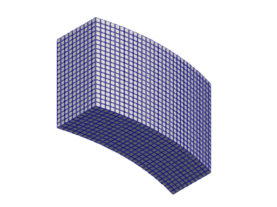
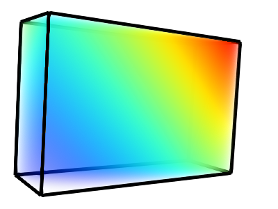
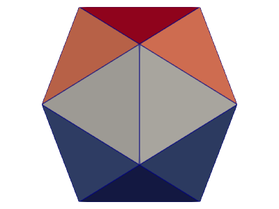
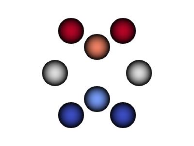

<h2>XDMF examples</h2>

A collection of simple examples demonstrating the use of XDMF
(eXtensible Data Model and Format) for scientific data description and
visualization. Includes various mesh topologies, file formats, and
Python scripts for reading, validating, and rendering XDMF files using
tools like ParaView, NumPy, and VTK.

<h3>Validation</h3>

<pre>
$ python valid.py Xdmf.dtd *.xdmf2
</pre>

<h3>TopologyType</h3>

Linear:
[Polyvertex](polyvertex.xdmf2),
[Polyline](polyline.xdmf2),
[Polygon](polygon.xdmf2),
[Triangle](triangle.xdmf2),
[Hexahedron](hexahedron.xdmf2)
[Quadrilateral](quadrilateral.xdmf2)

Arbitrary:
[Mixed](mixed.xdmf2)

Quadratic:
[Edge_3](edge_3.xdmf2),
[Tri_3](triangle_6.xdmf2)

Structured:
[3DCoRectMesh](3dcorectmesh.xdmf2),
[3DSMesh](3DSMesh.py)

Coordinate Adjusted Box:
<pre>
$ python box.py
box.py: box.xdmf2
</pre>

[Open NPY file format directly](npy.py):
<pre>
$ python npy.py
npy.py: offset=128
npy.py: attr_path='npy.attr.npy'
npy.py: xdmf_path='npy.xdmf2'
</pre>

[read XDMF file using VTK library](vtk.py):
<pre>
$ python -P vtk.py 3dcorectmesh.xdmf2
vtk.py: cell, points: 6, 24
$ for i in *.xdmf2; do python -P vtk.py $i; done
...
</pre>

Render in [ParaView](www.paraview.org):
<pre>
$ python icosahedron.py icosahedron.xdmf2
$ pvbatch view.py icosahedron.xdmf2 icosahedron.png
</pre>

[Generate particle data in C](particle.c):
<pre>
$ cc particles.c -o particles
$ ./particles > particles.xdmf2
$ pvbatch view.py particles.xdmf2 particles.png
</pre>

<h3>References</h3>

1. Mark, E. "Enhancements to the extensible data model and format (xdmf)." 2007 DoD High Performance Computing Modernization Program Users Group Conference. IEEE, 2007. <https://apps.dtic.mil/sti/tr/pdf/ADP023792.pdf>
2. <https://www.xdmf.org/index.php/XDMF_Model_and_Format>
3. [VisIt User Manual](https://visit-sphinx-github-user-manual.readthedocs.io/en/task-allen-vtk9_master_ospray/data_into_visit/XdmfFormat.html)
4. [vtkXdmfReader](https://vtk.org/doc/nightly/html/classvtkXdmfReader.html)
5. <https://gitlab.kitware.com/xdmf/xdmf>
